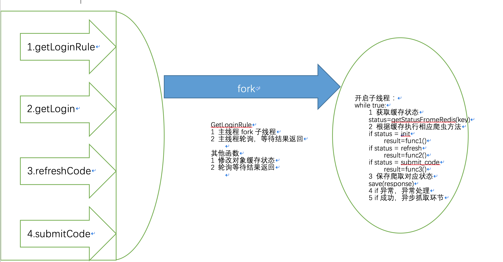

# 爬虫知识梳理

### 爬虫开发环境介绍 
爬虫开发环境.md (https://github.com/langgithub/python_spider/blob/master/%E7%88%AC%E8%99%AB%E5%BC%80%E5%8F%91%E7%8E%AF%E5%A2%83.MD）

### 爬虫系统涉及知识
1. http协议 与 https协议 （https://langgithub.github.io/2019/06/13/http%E4%B8%8Ehttps/）
2. Cookie池
3. User-Agent池 查看文件 （https://github.com/langgithub/python_spider/blob/master/User-Agent.txt）
4. ip代理池
    > 短效代理=>站大爷 
    > 长效代理=>购买服务器，装adsl服务
5. DNS缓存 爬虫框架会涉及
6. 抓包 fiddler,charles

### 按照业务爬虫分类：
1. 在线爬虫 （某淘宝，某运营商,某人行征信）

    * 后台控制逻辑，控制爬虫抓取步骤。如：某在线爬虫步骤
        > 第一阶段：SeleniumPhaseStatus.INIT => 登陆初始化阶段（用户传过来用户名或密码） 
        > 第二阶段：SeleniumPhaseStatus.REFRESH_CODE => 登陆需要验证码或短信验证码（用户刷新接口，到爬虫刷新接口） 
        > 第三阶段：SeleniumPhaseStatus.INPUT_CODE => 登陆输入验证码（用户传递过来的验证码）
    * 进入初始化爬虫（分发器），主线程启动单线程轮询以上阶段完成爬虫任务
        > 1. 读取redis中存放爬虫阶段 
        > 2. 根据阶段进入相应爬虫，返回相依response） 
        > 3. 调用getSeleniumServerStateFromJson，根据response设置爬虫阶段状态
    * 主线程启动单线程后，轮询等待结果
        > 1. 读取redis中存放爬虫阶段 
        > 2. 判断阶段 if "FAIL" return seleniumCrawlResponse.errorCode 
        > 3. 判断阶段 if "WAIT_CODE" return seleniumCrawlResponse.errorCode(这个值在爬虫后调用getSeleniumServerStateFromJson中都会更新成NONE，或者程序异常) 
        > 4. 判断阶段 if "SUCCESS" return ErrorCode.SUCCESS 
        > 5. result 有状态返回，结束
        
2. 离线爬虫 （requests模块，scrapy模块）

### 按照难度爬虫分类
1. 接口爬虫 （抓取破解）
2. selenium自动化爬虫
    * 启动hub集群（需要其他参数自行看）
    > java -jar selenium-server-standalone-3.8.1.jar -role hub -browserTimeout 60
    
    * 启动node节点
    > 1. node 是firfox。注意webdriver.gecko.driver路径
    java -jar selenium-server-standalone-3.8.1.jar -role node  -hub http://192.168.176.1:4444/grid/register  -browser  "browserName=firefox,webdriver.gecko.driver=/usr/local/bin/geckodriver"
    
    > 2. node 是chrome。注意Dwebdriver.chrome.driver路径
    java  -Dwebdriver.chrome.driver=/Users/yuanlang/work/javascript/chromedriver -jar selenium-server-standalone-3.8.1.jar -role node  -hub http://192.168.176.1:4444/grid/register  -browser  browserName=chrome
    
    > 3. node 是IE。selenum2.x 注意Dwebdriver.ie.driver路径;selenium3.x已经废除-Dwebdriver.ie.driver 需要将IEDriverServer.exe 放入到c:\program files\internet explorer 并添加到path
    java  -jar selenium-server-standalone-3.8.1.jar -role node  -hub http://192.168.176.1:4444/grid/register  -browser  browserName=ie
3. 集成自动化到docker